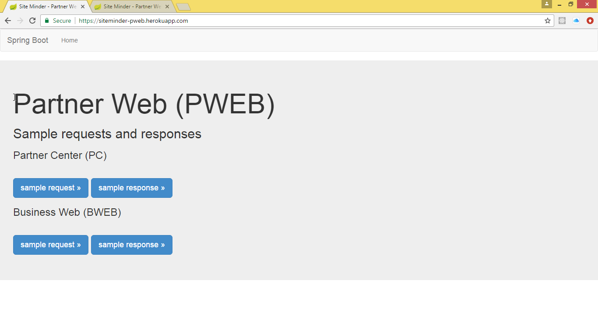
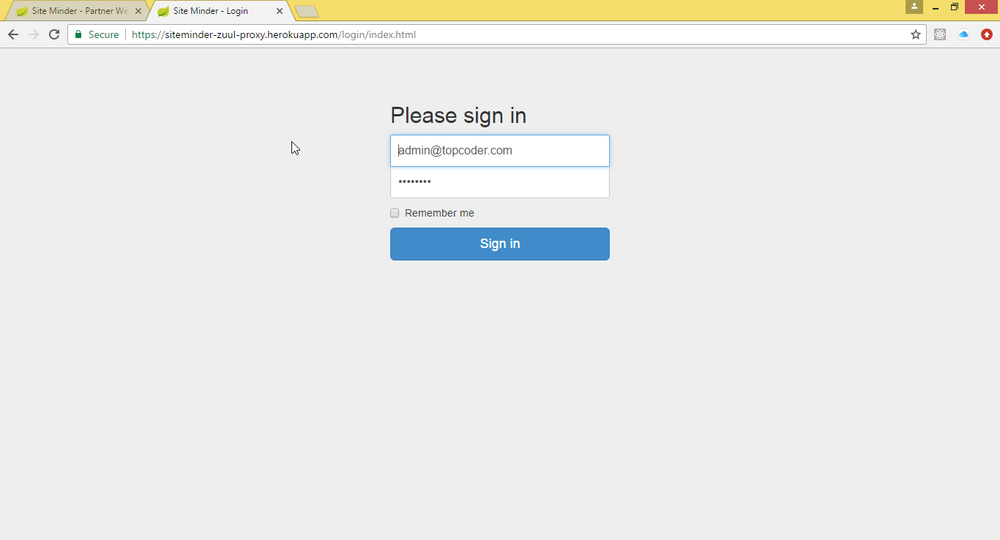
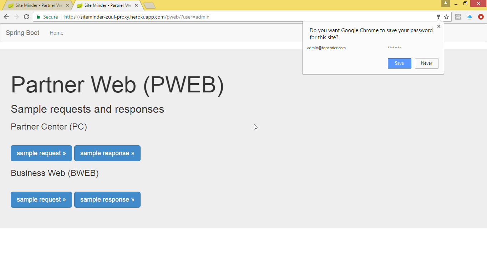

# SM engine - Proxy Server POC

## Introduction
Two Spring Boot apps were built to demonstrate that the requirements are feasible using Netflix Zuul.

- `siteminder-pweb`
- `siteminder-zuul-proxy`


## Deployment
## Local Deployment
1.0. Please install the `mvn` build tool and ensure it is in your `PATH`.

2.0. Open 2 separate console tabs then execute these commands:
2.1. Console tab #1

- `cd siteminder-pweb/`
- `mvn spring-boot:run`


2.2. Console tab #2

- `cd siteminder-zuul-proxy/`
- `vim src/main/resources/application.yml` # edit it to use the URL of the first app (by uncommenting `url: http://localhost:8080/`)
- `mvn spring-boot:run`


### Heroku Deployment
To deploy the two apps to Heroku, please download and install the latest `heroku-cli` tool then follow the instructions that follow.

1.0. Open a console then execute the following command to login to Heroku: 
```
heroku login
```

2.0. Next open 2 separate console tabs then execute these commands:
2.1. Console tab #1

- `cd siteminder-pweb/`
- `git init`
- `git add .`
- `git commit -m "first commit"`
- `heroku create siteminder-pweb` # please change the name for your Heroku account
- `git push heroku master`
- `heroku open` # then **navigate** to https://siteminder-pweb.herokuapp.com/
- `heroku logs --tail`


2.2. Console tab #2

- `cd siteminder-zuul-proxy/`
- `vim src/main/resources/application.yml` # edit it to use the URL of the first Heroku app
- `git init`
- `git add .`
- `git commit -m "first commit"`
- `heroku create siteminder-zuul-proxy` # please change the name for your Heroku account
- `git push heroku master`
- `heroku open` # then **navigate** to https://siteminder-zuul-proxy.herokuapp.com/pweb/
- `heroku logs --tail`


3.0. View the 2 apps on Heroku
3.1. Visit https://siteminder-pweb.herokuapp.com/


3.2. Visit https://siteminder-zuul-proxy.herokuapp.com/pweb/ then click "Sign in" to login with the default credentials.






## Testing 
The PoC implements the 3 major requirements that were requested:

- It allows proxying using the sample request/response body provided;
- It adds http headers to the proxied request (`X-Application-Context: zuulserver:8765`);
- It redirects to a login page if the request doesn't have a `user`/`token` parameter in the body.


### Local Testing
```
cd siteminder-pweb\src\main\resources\static\get_order_data # Windows
cd siteminder-pweb/src/main/resources/static/get_order_data # Unix
cat 01_request.xml | curl http://localhost:8765/pweb/GetOrderData/?debug=true -L -v -X POST -H "content-type: application/xml" -d @-
cat 02_request.xml | curl http://localhost:8765/pweb/GetOrderData/?debug=true -L -v -X POST -H "content-type: application/xml" -d @-
cat 03_request.xml | curl http://localhost:8765/pweb/GetOrderData/?debug=true -L -v -X POST -H "content-type: application/xml" -d @-
```

### Heroku Testing 
```
cd submission\siteminder-pweb\src\main\resources\static\get_order_data
cat 01_request.xml | curl https://siteminder-zuul-proxy.herokuapp.com/pweb/GetOrderData/?debug=true -L -v -X POST -H "content-type: application/xml" -d @-
cat 02_request.xml | curl https://siteminder-zuul-proxy.herokuapp.com/pweb/GetOrderData/?debug=true -L -v -X POST -H "content-type: application/xml" -d @-
cat 03_request.xml | curl https://siteminder-zuul-proxy.herokuapp.com/pweb/GetOrderData/?debug=true -L -v -X POST -H "content-type: application/xml" -d @-
```


## Install the Spring Boot CLI
*A summary of the commands to be executed are provided at the end of this section.*

* Download the current version of the `spring-boot-cli` zip archive [`spring-boot-cli-1.5.6.RELEASE-bin.zip`](http://repo.spring.io/release/org/springframework/boot/spring-boot-cli/1.5.6.RELEASE/spring-boot-cli-1.5.6.RELEASE-bin.zip) to your machine.
```
mkdir -p /tmp/submission/
cd /tmp/submission/
curl -O http://repo.spring.io/release/org/springframework/boot/spring-boot-cli/1.5.6.RELEASE/spring-boot-cli-1.5.6.RELEASE-bin.zip
```

* Extract the `spring-boot-cli` zip archive to a path on your filesystem.
```
unzip spring-boot-cli-1.5.6.RELEASE-bin.zip 
mv spring-1.5.6.RELEASE\ spring-boot-cli-1.5.6.RELEASE-bin\
```

* Append `\bin` to the full path to `spring-boot-cli` then add it to your PATH i.e. `/path/to/spring-boot-cli` + `/bin`. 
```
# Windows
set SPRING_BOOT_CLI=D:\Apps\spring-boot-cli-1.5.6.RELEASE-bin
set PATH=%PATH%;%SPRING_BOOT_CLI%\bin

# Linux
SPRING_BOOT_CLI=/home/tc/bin/spring-boot-cli-1.5.6.RELEASE-bin 
export PATH=$PATH:$SPRING_BOOT_CLI/bin
```

* Confirm the installation succeeded with `spring --version`:
```
spring --version
Spring CLI v1.5.6.RELEASE
```

